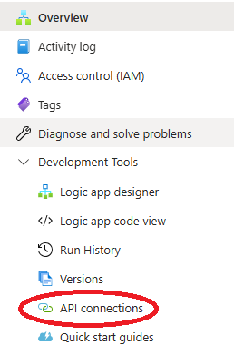
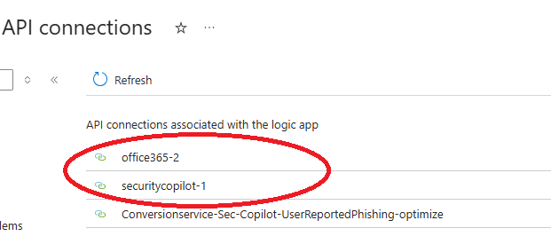
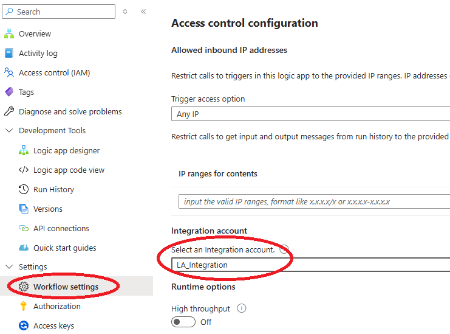

# ISAC Email Processing with Copilot for Security
Author: Chaitanya Belwal

Information Sharing and Analysis Center (ISAC) is an organization that provides a central resource for gathering information on cyber and related threats to critical infrastructure and play a critical role in safeguarding industries from emerging threats. By bridging the gap between private and public sectors, ISACs provide timely and actionable intelligence on vulnerabilities that impact critical infrastructure. However, manually processing these threat bulletins can be overwhelming and slow, leaving security teams scrambling to respond in time. 

In this Logic App, ISAC emails containing CVEs are processed by analyzing the mailbox, extracting the CVEs and using Copilot for Security, the presense of those CVEs are analyzed in the environment. 

The information for CVEs detected in your environment is then enriched with data from MDTI and a consolidated HTML report is then emailed to one of more specified mailbox(es).

This way the generic ISAC email that contains a list of CVEs is converted to an actionable email containing only the CVEs that exist in your environment. The CVE information if further enriched with relevant information from Microsoft Defender Threat Intelligence.

## Deploying the Solution

### Step 1: Deploy the Logic App

Click the button below to deploy the Logic App:

### Step 2: Initialize O365 and Security Copilot API connections

Open the Logic App and click "API Connections" on the left navigation pane:

Authorize both of the API connections (you may need to sign-in individually for both API connections):

### Step 3: Enable the Logic App

Make sure the Logic App is enabled:

 
